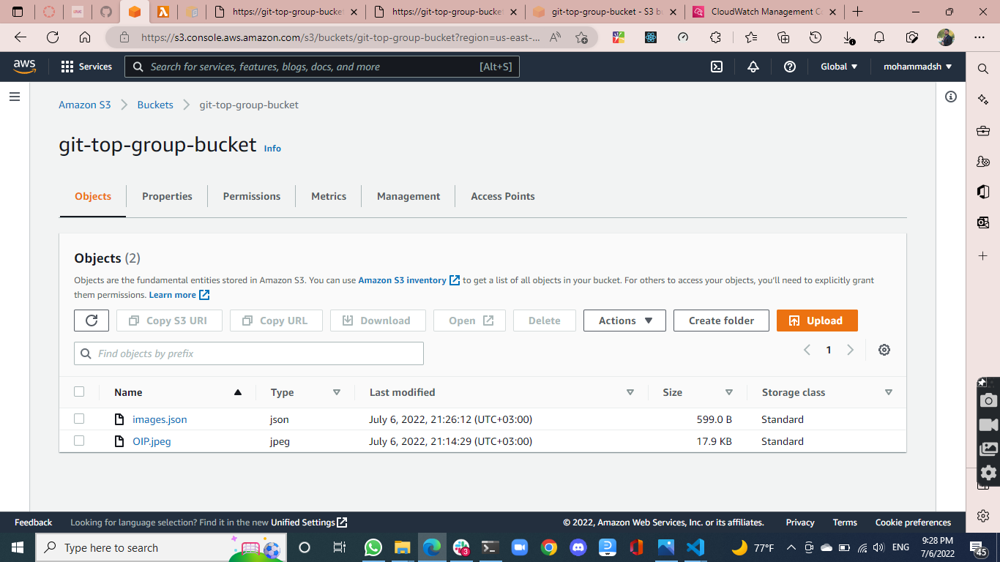
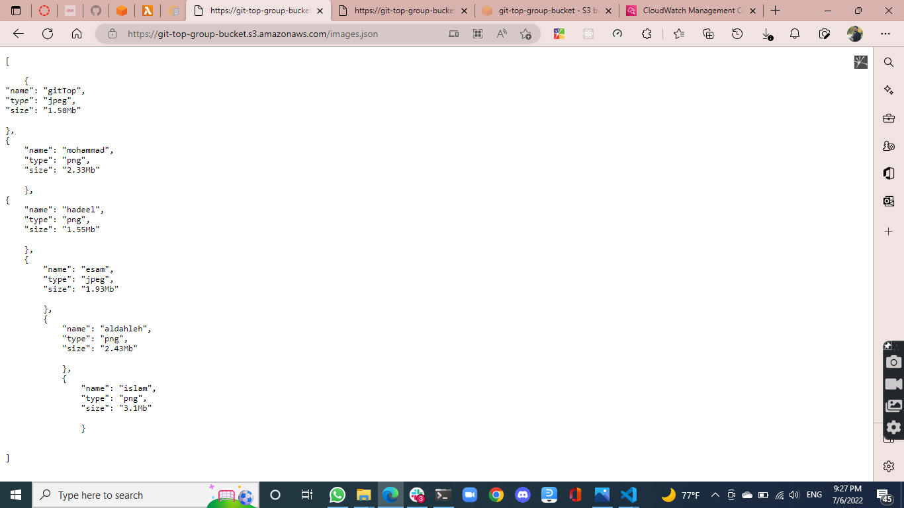
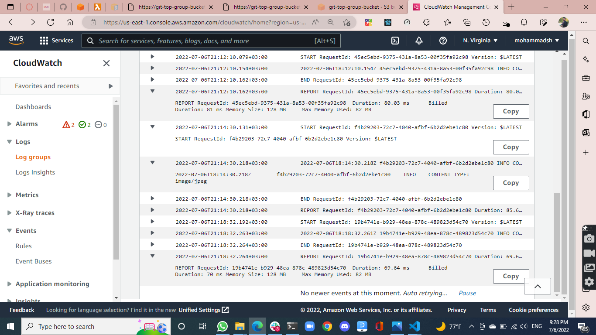

# image-lambda

[images.json link](https://git-top-group-bucket.s3.amazonaws.com/images.json)

this is our bucket : 

`git-top-group-bucket`

`git-top-group-function`

this is our Lembda function :

this is images.json results :

this is log groups :

---------------------------
how to use Lembda : 

To create a Lambda function from a blueprint in the console

Open the Functions page of the Lambda console.

Choose Create function.

On the Create function page, choose Use a blueprint.

Under Blueprints, enter s3 in the search box.

In the search results, do one of the following:

For a Node.js function, choose s3-get-object.

For a Python function, choose s3-get-object-python.

Choose Configure.

Under Basic information, do the following:

For Function name, enter my-s3-function.

For Execution role, choose Create a new role from AWS policy templates.

For Role name, enter my-s3-function-role.

Under S3 trigger, choose the S3 bucket that you created previously.

When you configure an S3 trigger using the Lambda console, the console modifies your function's resource-based policy to allow Amazon S3 to invoke the function.

Choose Create function.

-----------------

GitTop group  ©  nothing reserved  ༼ つ ◕_◕ ༽つ  